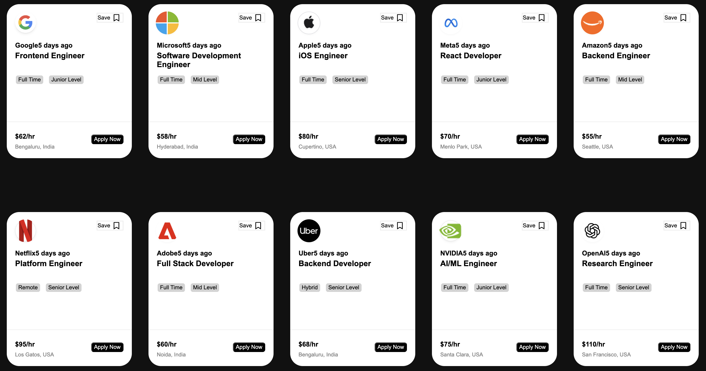

# Job Board Cards UI

A modern, responsive grid of job opening cards built from scratch using React, Vite, and custom CSS. 

This project demonstrates clean UI design principles, including flexbox layouts, uniform card structures, text truncation for long titles, and dynamic data rendering.

## 🌟 Features

- **Dynamic Rendering**: Cards are rendered dynamically by mapping over an array of job listing objects.
- **Modern UI/UX**: Includes a clean dark mode background, high-resolution company logos, and styled tags.
- **Uniform Layouts**: Uses Flexbox and CSS min-height constraints to ensure all cards align perfectly, regardless of varying text lengths.
- **Reliable Assets**: Integrates Google's Favicon service to dynamically fetch high-quality, up-to-date company logos based on their domain.

## 🛠️ Tech Stack

- **React** (Components, Props, JSX)
- **Vite** (Next Generation Frontend Tooling)
- **CSS3** (Flexbox, custom styling, responsive design)

## 🚀 Getting Started

To run this project locally on your machine, follow these steps:

1. **Clone the repository:**
   ```bash
   git clone https://github.com/your-username/your-repo-name.git
   ```

2. **Navigate to the project directory:**
   ```bash
   cd your-repo-name
   ```

3. **Install the dependencies:**
   ```bash
   npm install
   ```

4. **Start the development server:**
   ```bash
   npm run dev
   ```

5. Open your browser and visit the `localhost` link provided in your terminal (usually `http://localhost:5173/`).

## 📸 Screenshots

*(Tip: Take a screenshot of your beautiful cards and save it as `preview.png` in your project folder, then uncomment the line below!)*

